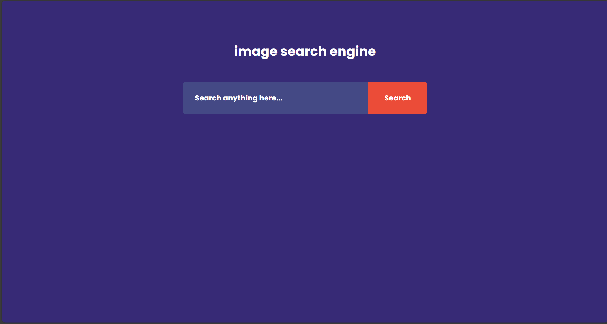
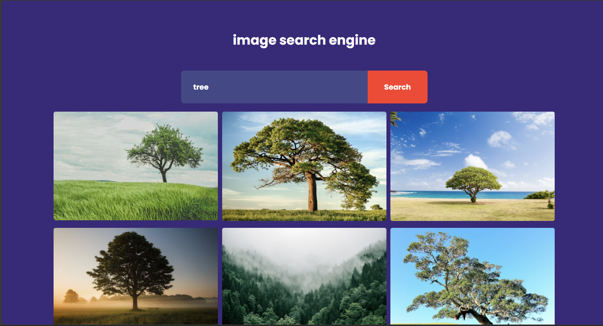

# Image Search Engine

This project is an Image Search Engine that allows users to search for images using keywords. The images are fetched from the Unsplash API.

https://nihalks-30.github.io/Image-Search-Engine/

  
  

## Features

- Search for images using keywords.
- Display results with clickable links to the original images on Unsplash.
- Responsive design with a clean and simple UI.

## Technologies Used

- HTML
- CSS
- JavaScript

## API Used

This project uses the [Unsplash API](https://unsplash.com/developers) to fetch images based on the search keywords.
